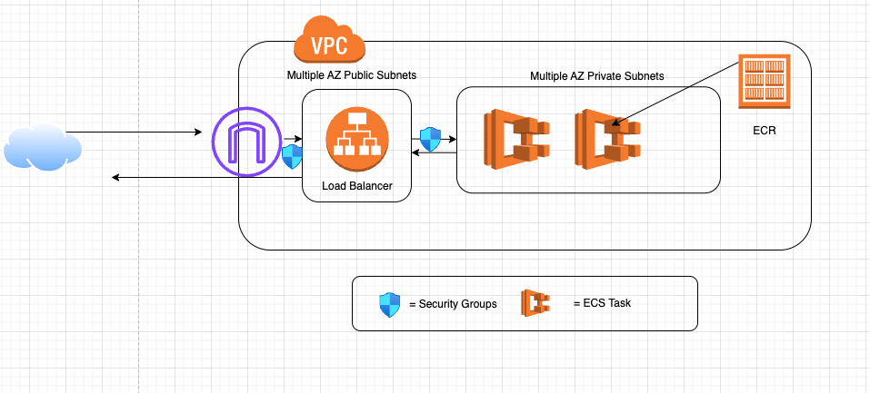

# To the panel of reviewers
Hello All,

First of all I apologize for the delay. As a matter of fact I was onsite to attend PI planning sessions and lead the planning for the upcoming commitments. I came back last Saturday evening and started to write 
the Terraform modules containing ECS and Fargate , which were not available as a part of my personal
Repo , I conveyed the same to Marina and thank you for considering my situation.

## About this small terrform repo

**Architecture** : Picture speaks thousand words.

## Details of the Diagram
Essentially the ECS cluster consist of fargates which reside in the private subnets,these subnets are multi az subnets to address availability and the application load balancer resides at the Public subnet, through sg rules only traffic from LB is allowed to the target group and the only available ports are 80 and 443, in reality you may not need 80 , I just kept it so that I can test quickly my network.The ECS is populated by the Jenkins pipeline, attached the Jenkinsfile for clarity.
Also please note I changed the target_type of the alb target group to ip as this is for fargate.
**please note this is a working sample and I ran it against my aws account so, incase you want to run it please replace <your-account-id> with your account-id**

## Conclusion
There can be more optimization done like making everything dynamic, but because of lack of time , I hard coded a few things to save time.Also I tried to tag every resource especially the iam roles, but I may miss a few tags here and there.

***Thank you all for the oppurtunity to show my understanding of IaaS***

